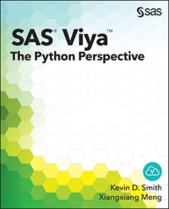

# SAS Viya: The Python Perspective

Kevin D Smith & Xiangxiang Meng

This project contains the sample code for the book *SAS Viya: The Python
Perspective*.  All examples are in the form of
[Jupyter notebooks](http://jupyter.org).

## Description

*Learn how to access analytics from SAS Cloud Analytic Services (CAS)
using Python and the SAS® Viya™ platform.*

SAS® Viya™: The Python Perspective is an introduction to using the
Python client on the SAS Viya platform. SAS Viya is a high-performance, 
fault-tolerant analytics architecture that can be deployed on both 
public and private cloud infrastructures. While SAS Viya can be used by 
various SAS applications, it also enables you to access analytic methods 
from SAS, Python, Lua, and Java, as well as through a REST interface 
using HTTP or HTTPS.

This book focuses on the perspective of SAS Viya from Python. SAS Viya 
is made up of multiple components. The central piece of this ecosystem 
is SAS Cloud Analytic Services (CAS). CAS is the cloud-based server 
that all clients communicate with to run analytical methods. The Python 
client is used to drive the CAS component directly using objects and 
constructs that are familiar to Python programmers.

Some knowledge of Python would be helpful before using this book;
however, there is an appendix that covers the features of Python that are 
used in the CAS Python client. Knowledge of CAS is not required to use 
this book. However, you will need to have a CAS server set up and 
running to execute the examples in this book.

With this book, you will learn how to:

* Install the required components for accessing CAS from Python
* Connect to CAS, load data, and run simple analyses
* Work with CAS using APIs familiar to Python users
* Learn about general CAS workflows and advanced features of the CAS Python client

SAS® Viya™: The Python Perspective covers topics that will be useful to
beginners as well as experienced CAS users. It includes examples from 
creating connections to CAS all the way to simple statistics and machine 
learning, but it is also useful as a desktop reference.

## Details

- *Epub* ISBN# 978-1-62960-883-9
- *Mobi* ISBN# 978-1-62960-884-6
- *PDF* ISBN# 978-1-62960-885-3
- *Hardcopy* ISBN# 978-1-62960-276-9
- *Pages* 306

- [Book Excerpt](https://www.sas.com/storefront/aux/en/splcpython/69194_excerpt.pdf)
- [Table of Contents](https://www.sas.com/storefront/aux/en/splcpython/69194_toc.pdf)
